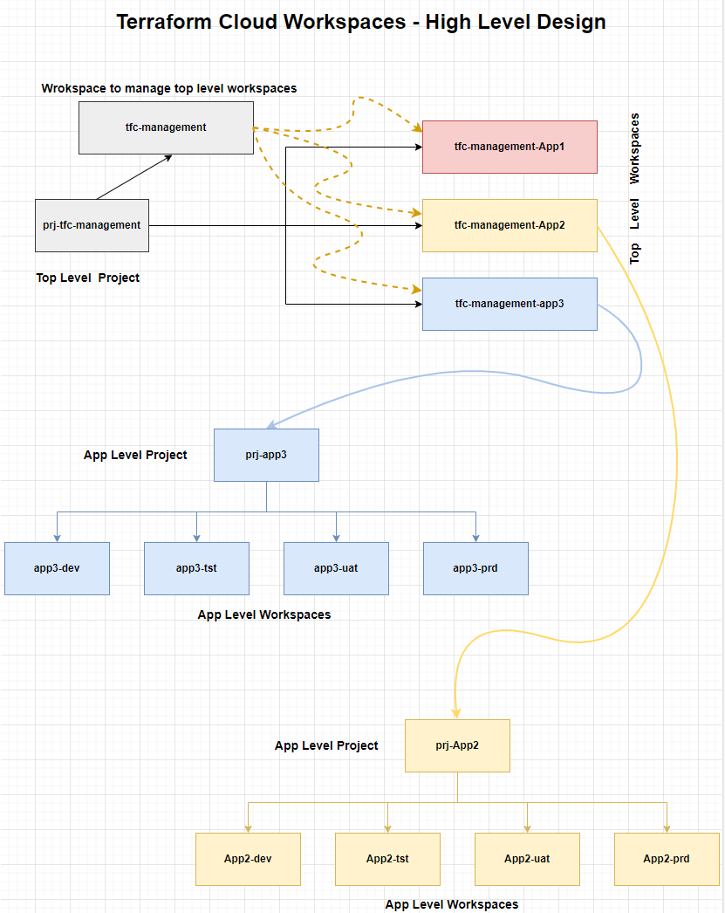

# Manage terraform projects and workspaces in Terraform Cloud

PREREQUISITE:

Top level workspace for the app exists and the variable-set "tfc-management-token" has been applied to that workspace. If not, got to "tfc-top-level" folder and follow the instructions in README.md file to create top level workspace first before proceeding further.

\
Terraform Cloud project and workspace structure followed as per below:

Steps:
1. Update the content of ./project_name.txt file with the name of the project/app.
2. It is assumed that the top level workspace (e.g. tfc-management-<app_git_repo_name>) exisits for the app and the variable-set apllied to the workspace.
3. Create an Azure AD group for the app and add appropriate staff into that group. The group name should be in the form of "Terraform-cloud-sso-<app_git_repo_name> e.g. Terraform-cloud-sso-network (only applicabe if using SSO)
4. Add the newly created group in the scope of the Azure AD Enterprise App called "Terraform Cloud" (only applicabe if using SSO, if not using SSO just create the group directly in terraform cloud)
5. Create a team with the same name in Terraform cloud and copy the team guid from Azure AD into newly created team id in Terraform cloud.
6. Create a folder, name it same as the app git repo name e.g store-infra. There are several folders that already exists for any of the exisitng apps that is deployed through this code. DO NOT delete any of those folders.
7. copy the ./example/terraform.tfvars file into the newly created folder and update the content of the terraform.tfvars file to adjust the permission needed for the new app.
8. Create a pull request to develop branch. When the code is merged into develop branch, it will run a plan showing the resources that will be created.
9. Observe the output of the plan in github actions, and when you are happy with the plan output, create a pull request to main branch. Once the code is merged into the main branch, terrafom will create necessary projects and workspaces and add appropriate permissions.
10. Go to terrafrom cloud portal and validate all the resource creation and permissions are correct.
